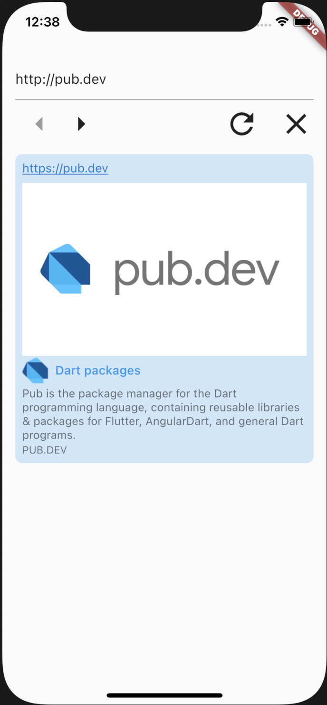
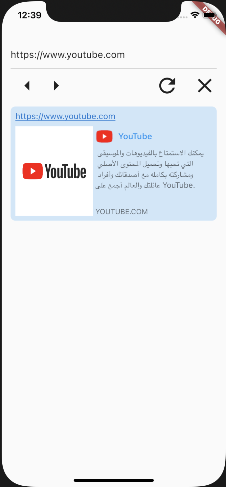

# link_preview

URL preview package to previews the content of a URL

## Getting Started

```dart
LinkPreview(
  text: "https://pub.dev",
)
```



```dart
LinkPreview(
  text: "https://youtube.com",
  linkDirection: LinkDirection.horizontal,
)
```



## Custom Widget

```dart
LinkPreview(
  key: UniqueKey(),
  text: "flutter.dev",
  builder: (info) {
    // ... custom widget here and you have access to: title, icon, descriptio, media
  },
),
```
